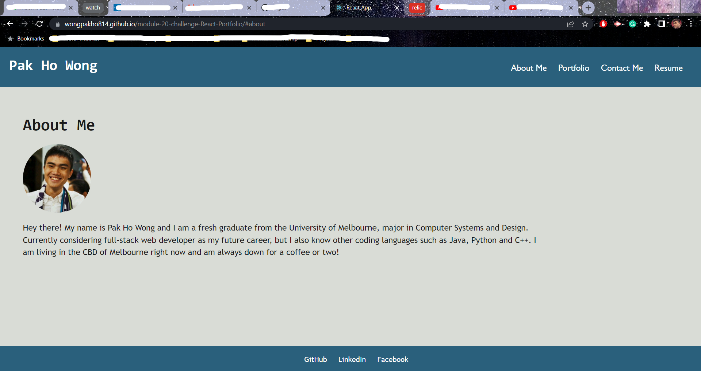

# Module 20 challenge: React Portfolio

## Description

This Module 20 Challenge repository was created to complete the Module 20 Challenge of the bootcamp.

This project aims to build a personal portfolio using React as the front-end development tool. The app only contains front-end related
code so some of the functionalities, such as the Contact Me and Resume page, will not work. 

## Installation

Please make sure to run the command "npm install" to install all required node modules before running the program. 
Please also make sure to run the command "npm run build" to build all client-side modules. 

## Usage

Please run the command "npm run start" in terminal to start the server.

Link to deployed application: https://wongpakho814.github.io/module-20-challenge-React-Portfolio/#portfolio

## Credits

N/A

## License

N/A
